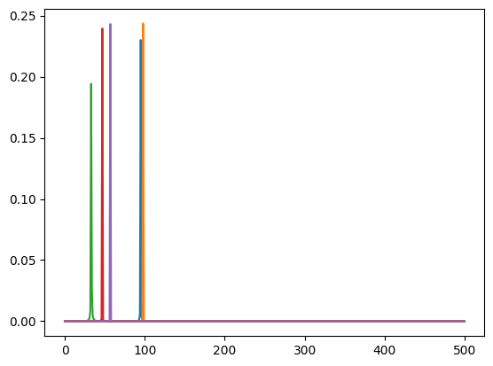
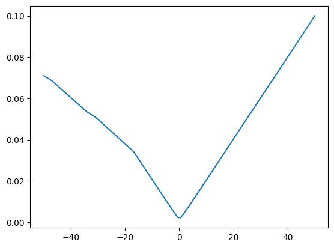
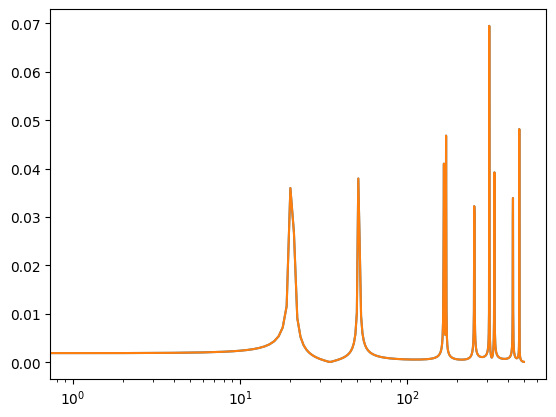
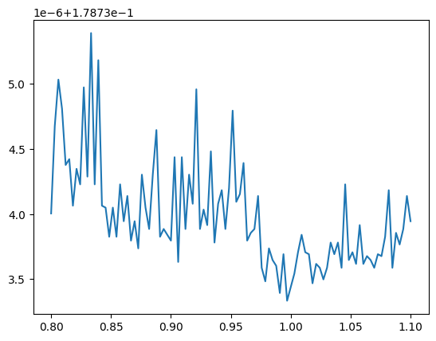

# Losses


<!-- WARNING: THIS FILE WAS AUTOGENERATED! DO NOT EDIT! -->

``` python
import matplotlib.pyplot as plt
```

------------------------------------------------------------------------

### wasserstein_1d

>  wasserstein_1d (u_values, v_values, u_weights=None, v_weights=None, p=1,
>                      require_sort=True)

\*Computes the 1 dimensional OT loss \[15\] between two (batched)
empirical distributions

.. math: OT\_{loss} = \_0^1 |cdf_u^{-1}(q) - cdf_v<sup>{-1}(q)|</sup>p
dq

It is formally the p-Wasserstein distance raised to the power p. We do
so in a vectorized way by first building the individual quantile
functions then integrating them.

This function should be preferred to `emd_1d` whenever the backend is
different to numpy, and when gradients over either sample positions or
weights are required.\*

<table>
<colgroup>
<col style="width: 6%" />
<col style="width: 25%" />
<col style="width: 34%" />
<col style="width: 34%" />
</colgroup>
<thead>
<tr>
<th></th>
<th><strong>Type</strong></th>
<th><strong>Default</strong></th>
<th><strong>Details</strong></th>
</tr>
</thead>
<tbody>
<tr>
<td>u_values</td>
<td></td>
<td></td>
<td></td>
</tr>
<tr>
<td>v_values</td>
<td></td>
<td></td>
<td></td>
</tr>
<tr>
<td>u_weights</td>
<td>NoneType</td>
<td>None</td>
<td></td>
</tr>
<tr>
<td>v_weights</td>
<td>NoneType</td>
<td>None</td>
<td></td>
</tr>
<tr>
<td>p</td>
<td>int</td>
<td>1</td>
<td></td>
</tr>
<tr>
<td>require_sort</td>
<td>bool</td>
<td>True</td>
<td></td>
</tr>
<tr>
<td><strong>Returns</strong></td>
<td><strong>cost: float/array-like, shape (…)</strong></td>
<td></td>
<td><strong>the batched EMD</strong></td>
</tr>
</tbody>
</table>

------------------------------------------------------------------------

### quantile_function

>  quantile_function (qs, cws, xs)

*Computes the quantile function of an empirical distribution*

<table>
<colgroup>
<col style="width: 9%" />
<col style="width: 38%" />
<col style="width: 52%" />
</colgroup>
<thead>
<tr>
<th></th>
<th><strong>Type</strong></th>
<th><strong>Details</strong></th>
</tr>
</thead>
<tbody>
<tr>
<td>qs</td>
<td></td>
<td></td>
</tr>
<tr>
<td>cws</td>
<td></td>
<td></td>
</tr>
<tr>
<td>xs</td>
<td></td>
<td></td>
</tr>
<tr>
<td><strong>Returns</strong></td>
<td><strong>q: array-like, shape (…, n)</strong></td>
<td><strong>The quantiles of the distribution</strong></td>
</tr>
</tbody>
</table>

------------------------------------------------------------------------

### compute_mag

>  compute_mag (x:jax.Array)

<table>
<thead>
<tr>
<th></th>
<th><strong>Type</strong></th>
<th><strong>Details</strong></th>
</tr>
</thead>
<tbody>
<tr>
<td>x</td>
<td>Array</td>
<td>(b, t)</td>
</tr>
<tr>
<td><strong>Returns</strong></td>
<td><strong>Array</strong></td>
<td></td>
</tr>
</tbody>
</table>

------------------------------------------------------------------------

### spectral_wasserstein

>  spectral_wasserstein (x, y, squared=True, is_mag=False)

------------------------------------------------------------------------

### log_mag_loss

>  log_mag_loss (pred:jax.Array, target:jax.Array, eps:float=1e-10,
>                    distance:str='l1')

*Spectral log magtinude loss but for a fft of a signal See [Arik et al.,
2018](https://arxiv.org/abs/1808.06719)*

<table>
<thead>
<tr>
<th></th>
<th><strong>Type</strong></th>
<th><strong>Default</strong></th>
<th><strong>Details</strong></th>
</tr>
</thead>
<tbody>
<tr>
<td>pred</td>
<td>Array</td>
<td></td>
<td>complex valued fft of the signal</td>
</tr>
<tr>
<td>target</td>
<td>Array</td>
<td></td>
<td>complex valued fft of the signal</td>
</tr>
<tr>
<td>eps</td>
<td>float</td>
<td>1e-10</td>
<td></td>
</tr>
<tr>
<td>distance</td>
<td>str</td>
<td>l1</td>
<td></td>
</tr>
</tbody>
</table>

------------------------------------------------------------------------

### log_mag

>  log_mag (x:jax.Array, eps:float=1e-10)

``` python
phase = 0.0
omegas = jax.random.uniform(jax.random.PRNGKey(0), shape=(10,)) * 100
mag = 0.99


def osc_bank(t, omegas):
    return mag * jnp.sin(omegas[..., None] * jnp.pi * 2 * t[None] + phase)
```

``` python
t = jnp.linspace(0, 1, 1000)
gt_osc_values = osc_bank(t, omegas)
# print(gt_osc_values)
print(gt_osc_values.shape)
```

    (10, 1000)

``` python
a = jax.vmap(spectral_wasserstein)(gt_osc_values, gt_osc_values)
print(a)
```

    [0. 0. 0. 0. 0. 0. 0. 0. 0. 0.]

``` python
def loss_fn(omega):
    pred_osc_values = osc_bank(t, omega)
    x_fft = compute_mag(gt_osc_values)
    y_fft = compute_mag(pred_osc_values)
    l2_mag_loss = jnp.mean((x_fft - y_fft) ** 2)
    return l2_mag_loss


def ot_loss_fn(omega):
    pred_osc_values = osc_bank(t, omega)

    ot_loss = jnp.mean(
        jax.vmap(spectral_wasserstein)(gt_osc_values, pred_osc_values),
    )
    return ot_loss
```

``` python
x_fft = compute_mag(gt_osc_values) ** 2
plt.plot(x_fft[:5].T)
```



``` python
ranges = jnp.linspace(-50, 50, 100)
omegas_scan = omegas + ranges[:, None]

# print(omegas_scan.shape)
loss, grad = jax.vmap(jax.value_and_grad(loss_fn))(omegas_scan)
loss_ot, grad_ot = jax.vmap(jax.value_and_grad(ot_loss_fn))(omegas_scan)

print(loss.shape, loss.dtype)
print(loss_ot.shape, loss_ot.dtype)
# loss_mean = jnp.mean(loss, axis=1)
# loss_ot_mean = jnp.mean(loss_ot, axis=-1)
# print(loss_mean.shape)
# plt.plot(ranges, loss)
plt.plot(ranges, loss_ot)
```

    (100,) float32
    (100,) float32



``` python
omegas_gt = jax.random.uniform(jax.random.PRNGKey(0), shape=(10,)) * 1000
omegas_pred = omegas_gt * 1

pred_osc_values = osc_bank(t, omegas_pred).mean(axis=0)
gt_osc_values = osc_bank(t, omegas_gt)

x_mag = compute_mag(gt_osc_values.mean(axis=0))
y_mag = compute_mag(pred_osc_values)

plt.semilogx(x_mag)
plt.semilogx(y_mag)
```



``` python
# from ott.solvers.linear import solve_univariate
from ott.solvers.linear.univariate import quantile_solver
from ott.geometry.pointcloud import PointCloud
from ott.problems.linear import linear_problem
from ott.solvers.linear import sinkhorn
from ott.solvers import linear


def wasserstein_1d_jax(
    x,
    y,
):
    geom = PointCloud(x, y)
    # prob = linear_problem.LinearProblem(geom)
    out = linear.solve(geom)
    return out.reg_ot_cost


# def wasserstein_1d_jax(
#     x: jnp.ndarray,
#     y: jnp.ndarray,
#     a: jnp.ndarray | None = None,
#     b: jnp.ndarray | None = None,
# ):
#     geom = PointCloud(x[..., None], y[..., None])
#     prob = linear_problem.LinearProblem(geom, a=a, b=b)
#     out = quantile_solver(prob)
#     return jnp.average(out.ot_costs)


def sinkhorn_loss(
    x,
    y,
    a,
    b,
    epsilon=1e-1,
    threshold=1e-3,
):
    geom = PointCloud(x[..., None], y[..., None], epsilon=epsilon)

    out = linear.solve(geom, a=a, b=b)
    return out.reg_ot_cost

    # prob = linear_problem.LinearProblem(geom, a=a, b=b)
    # solver = sinkhorn.Sinkhorn(
    #     threshold=threshold,
    #     max_iterations=1000,
    #     norm_error=2,
    #     lse_mode=True,
    # )
    # out = solver(prob)
    # out.reg_ot_cost
    # return jnp.average(out.ot_costs)
```

``` python
x_pos = jnp.linspace(0, 1, x_mag.shape[-1])
stacked_x = jnp.stack([x_pos, x_mag], axis=-1)
stacked_y = jnp.stack([x_pos, x_mag], axis=-1)

print(stacked_x.shape, stacked_y.shape)

ot_costs_jax = wasserstein_1d_jax(stacked_x, stacked_y)
print(ot_costs_jax)
```

    (501, 2) (501, 2)
    0.017973557

``` python
x_mag = x_mag / jnp.sum(x_mag)
y_mag = y_mag / jnp.sum(y_mag)
x_pos = jnp.linspace(0, 1, x_mag.shape[-1])

ot_costs = wasserstein_1d(x_pos, x_pos, x_mag, y_mag)
print(ot_costs)
```

    0.0

``` python
stacked = jnp.stack([x_pos, x_mag], axis=-1)
print(stacked.shape)
# plt.scatter(stacked[:, 0], stacked[:, 1])
```

    (501, 2)

``` python
def loss_fn_ot(factor):
    pred_osc_values = osc_bank(t, omegas_gt * factor)
    # x_mag = compute_mag(gt_osc_values)
    # y_mag = compute_mag(pred_osc_values)
    # x_mag = x_mag / jnp.sum(x_mag)
    # y_mag = y_mag / jnp.sum(y_mag)
    # x_pos = jnp.linspace(0, 1, x_mag.shape[-1])
    # ot_cost = wasserstein_1d(x_pos, x_pos, x_mag, y_mag)

    ot_cost = jnp.mean(
        jax.vmap(spectral_wasserstein)(gt_osc_values, pred_osc_values),
    )
    return ot_cost


def loss_fn_ot_jax(factor):
    pred_osc_values = osc_bank(t, omegas_gt * factor).mean(axis=0)
    x_mag = jnp.log(compute_mag(gt_osc_values.mean(axis=0)))
    y_mag = jnp.log(compute_mag(pred_osc_values))
    x_mag = x_mag / jnp.sum(x_mag)
    y_mag = y_mag / jnp.sum(y_mag)

    x_pos = jnp.linspace(0, 1, x_mag.shape[-1])
    stacked_x = jnp.stack([x_pos, x_mag], axis=-1)
    stacked_y = jnp.stack([x_pos, y_mag], axis=-1)

    ot_cost = wasserstein_1d_jax(stacked_x, stacked_y)
    return ot_cost


def loss_fn_sinkhorn(factor):
    pred_osc_values = osc_bank(t, omegas_gt * factor).mean(axis=0)
    x_mag = compute_mag(gt_osc_values.mean(axis=0))
    y_mag = compute_mag(pred_osc_values)
    x_mag = x_mag / jnp.sum(x_mag)
    y_mag = y_mag / jnp.sum(y_mag)
    x_pos = jnp.linspace(0, 1, x_mag.shape[-1])
    return sinkhorn_loss(x_pos, x_pos, x_mag, y_mag)


ranges = jnp.linspace(0.8, 1.1, 100)

# print(omegas_scan.shape)
loss_ot, grad_ot = jax.vmap(jax.value_and_grad(loss_fn_ot))(ranges)
loss_ot_jax, grad_ot_jax = jax.vmap(jax.value_and_grad(loss_fn_ot_jax))(ranges)
loss_sinkhorn, grad_sinkhorn = jax.vmap(jax.value_and_grad(loss_fn_sinkhorn))(ranges)

fig, ax = plt.subplots(1, 1)
# ax.plot(ranges, loss_ot)
ax.plot(ranges, loss_ot_jax * 10)
# ax.plot(ranges, loss_sinkhorn * 10)
```



------------------------------------------------------------------------

### spectral_convergence_loss

>  spectral_convergence_loss (pred:jax.Array, target:jax.Array)

*Spectral convergence loss but for a fft of a signal See [Arik et al.,
2018](https://arxiv.org/abs/1808.06719)*

<table>
<thead>
<tr>
<th></th>
<th><strong>Type</strong></th>
<th><strong>Details</strong></th>
</tr>
</thead>
<tbody>
<tr>
<td>pred</td>
<td>Array</td>
<td>magnitude of the fft of the predicted signal</td>
</tr>
<tr>
<td>target</td>
<td>Array</td>
<td>magnitude of the fft of the target signal</td>
</tr>
</tbody>
</table>
