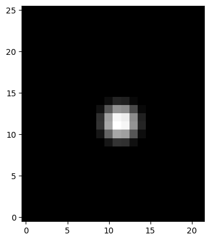

# Excitation functions


<!-- WARNING: THIS FILE WAS AUTOGENERATED! DO NOT EDIT! -->

``` python
import matplotlib.pyplot as plt
```

------------------------------------------------------------------------

### create_1d_raised_cosine

>      create_1d_raised_cosine (duration:float, start_time:float,
>                               end_time:float, amplitude:float,
>                               sample_rate:float)

*Create a 1D raised cosine excitation with time parameters in seconds.*

<table>
<thead>
<tr class="header">
<th></th>
<th><strong>Type</strong></th>
<th><strong>Details</strong></th>
</tr>
</thead>
<tbody>
<tr class="odd">
<td>duration</td>
<td>float</td>
<td>Total duration of the excitation (in seconds).</td>
</tr>
<tr class="even">
<td>start_time</td>
<td>float</td>
<td>Start time of the excitation (in seconds).</td>
</tr>
<tr class="odd">
<td>end_time</td>
<td>float</td>
<td>End time of the excitation (in seconds).</td>
</tr>
<tr class="even">
<td>amplitude</td>
<td>float</td>
<td>Amplitude of the excitation.</td>
</tr>
<tr class="odd">
<td>sample_rate</td>
<td>float</td>
<td>Sample rate (samples per second).</td>
</tr>
<tr class="even">
<td><strong>Returns</strong></td>
<td><strong>ndarray</strong></td>
<td><strong>The excitation signal.</strong></td>
</tr>
</tbody>
</table>

``` python
rc = create_1d_raised_cosine(
    1,
    0.01,
    0.05,
    1,
    44100,
)

plt.plot(rc)
```


------------------------------------------------------------------------

### create_raised_cosine

>      create_raised_cosine (Nx, Ny, h, ctr, epsilon, wid)

\*Create a raised cosine function on a 2D grid.

Parameters: Nx (int): Number of grid points in the x-direction. Ny
(int): Number of grid points in the y-direction. h (float): Grid
spacing. ctr (tuple): Center of the raised cosine (x, y). epsilon
(float): Scaling parameter. wid (float): Width of the cosine.

Returns: np.ndarray: Flattened raised cosine array.\*

``` python
from matplotlib import pyplot as plt
```

``` python
# Example usage
Nx, Ny = 25, 21  # Grid dimensions
h = 0.0438  # Grid spacing
ctr = (0.5, 0.5)  # Center of the raised cosine
epsilon = 1.2000  # Scaling parameter
wid = 0.3  # Width of the cosine

rc, X, Y, dist, distx, disty = create_raised_cosine(
    Nx,
    Ny,
    h,
    ctr,
    epsilon,
    wid,
)

plt.imshow(rc, cmap="gray", origin="lower")
```



------------------------------------------------------------------------

### create_pluck_modal

>      create_pluck_modal (lambdas:numpy.ndarray, pluck_position:float=0.28,
>                          initial_deflection:float=0.03,
>                          string_length:float=1.0)

*Create a pluck excitation for a string with a given length and pluck
position. The pluck is modeled in the modal domain.*

<table>
<colgroup>
<col style="width: 6%" />
<col style="width: 25%" />
<col style="width: 34%" />
<col style="width: 34%" />
</colgroup>
<thead>
<tr class="header">
<th></th>
<th><strong>Type</strong></th>
<th><strong>Default</strong></th>
<th><strong>Details</strong></th>
</tr>
</thead>
<tbody>
<tr class="odd">
<td>lambdas</td>
<td>ndarray</td>
<td></td>
<td>eigenvalues of the Laplacian operator</td>
</tr>
<tr class="even">
<td>pluck_position</td>
<td>float</td>
<td>0.28</td>
<td>position of pluck on the string in meters</td>
</tr>
<tr class="odd">
<td>initial_deflection</td>
<td>float</td>
<td>0.03</td>
<td>initial deflection of the string in meters</td>
</tr>
<tr class="even">
<td>string_length</td>
<td>float</td>
<td>1.0</td>
<td>total length of the string in meters</td>
</tr>
<tr class="odd">
<td><strong>Returns</strong></td>
<td><strong>ndarray</strong></td>
<td></td>
<td><strong>The pluck excitation in the modal domain.</strong></td>
</tr>
</tbody>
</table>
