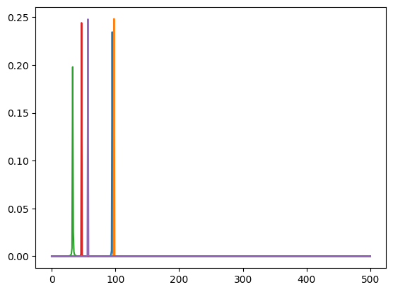
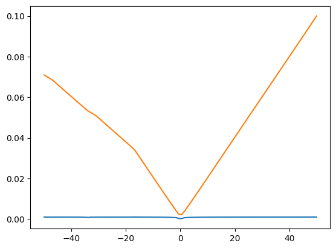

# Losses


<!-- WARNING: THIS FILE WAS AUTOGENERATED! DO NOT EDIT! -->

``` python
import matplotlib.pyplot as plt
```

------------------------------------------------------------------------

### wasserstein_1d

>      wasserstein_1d (u_values, v_values, u_weights=None, v_weights=None, p=1,
>                      require_sort=True)

\*Computes the 1 dimensional OT loss \[15\] between two (batched)
empirical distributions

.. math: OT\_{loss} = \_0^1 |cdf_u^{-1}(q) - cdf_v<sup>{-1}(q)|</sup>p
dq

It is formally the p-Wasserstein distance raised to the power p. We do
so in a vectorized way by first building the individual quantile
functions then integrating them.

This function should be preferred to `emd_1d` whenever the backend is
different to numpy, and when gradients over either sample positions or
weights are required.\*

<table>
<colgroup>
<col style="width: 6%" />
<col style="width: 25%" />
<col style="width: 34%" />
<col style="width: 34%" />
</colgroup>
<thead>
<tr class="header">
<th></th>
<th><strong>Type</strong></th>
<th><strong>Default</strong></th>
<th><strong>Details</strong></th>
</tr>
</thead>
<tbody>
<tr class="odd">
<td>u_values</td>
<td></td>
<td></td>
<td></td>
</tr>
<tr class="even">
<td>v_values</td>
<td></td>
<td></td>
<td></td>
</tr>
<tr class="odd">
<td>u_weights</td>
<td>NoneType</td>
<td>None</td>
<td></td>
</tr>
<tr class="even">
<td>v_weights</td>
<td>NoneType</td>
<td>None</td>
<td></td>
</tr>
<tr class="odd">
<td>p</td>
<td>int</td>
<td>1</td>
<td></td>
</tr>
<tr class="even">
<td>require_sort</td>
<td>bool</td>
<td>True</td>
<td></td>
</tr>
<tr class="odd">
<td><strong>Returns</strong></td>
<td><strong>cost: float/array-like, shape (…)</strong></td>
<td></td>
<td><strong>the batched EMD</strong></td>
</tr>
</tbody>
</table>

------------------------------------------------------------------------

### quantile_function

>      quantile_function (qs, cws, xs)

*Computes the quantile function of an empirical distribution*

<table>
<colgroup>
<col style="width: 9%" />
<col style="width: 38%" />
<col style="width: 52%" />
</colgroup>
<thead>
<tr class="header">
<th></th>
<th><strong>Type</strong></th>
<th><strong>Details</strong></th>
</tr>
</thead>
<tbody>
<tr class="odd">
<td>qs</td>
<td></td>
<td></td>
</tr>
<tr class="even">
<td>cws</td>
<td></td>
<td></td>
</tr>
<tr class="odd">
<td>xs</td>
<td></td>
<td></td>
</tr>
<tr class="even">
<td><strong>Returns</strong></td>
<td><strong>q: array-like, shape (…, n)</strong></td>
<td><strong>The quantiles of the distribution</strong></td>
</tr>
</tbody>
</table>

------------------------------------------------------------------------

### compute_mag

>      compute_mag (x:jax.Array)

<table>
<thead>
<tr class="header">
<th></th>
<th><strong>Type</strong></th>
<th><strong>Details</strong></th>
</tr>
</thead>
<tbody>
<tr class="odd">
<td>x</td>
<td>Array</td>
<td>(b, t)</td>
</tr>
<tr class="even">
<td><strong>Returns</strong></td>
<td><strong>Array</strong></td>
<td></td>
</tr>
</tbody>
</table>

------------------------------------------------------------------------

### spectral_wasserstein

>      spectral_wasserstein (x, y, squared=True, is_mag=False)

------------------------------------------------------------------------

### log_mag_loss

>      log_mag_loss (pred:jax.Array, target:jax.Array, eps:float=1e-10,
>                    distance:str='l1')

*Spectral log magtinude loss but for a fft of a signal See [Arik et al.,
2018](https://arxiv.org/abs/1808.06719)*

<table>
<thead>
<tr class="header">
<th></th>
<th><strong>Type</strong></th>
<th><strong>Default</strong></th>
<th><strong>Details</strong></th>
</tr>
</thead>
<tbody>
<tr class="odd">
<td>pred</td>
<td>Array</td>
<td></td>
<td>complex valued fft of the signal</td>
</tr>
<tr class="even">
<td>target</td>
<td>Array</td>
<td></td>
<td>complex valued fft of the signal</td>
</tr>
<tr class="odd">
<td>eps</td>
<td>float</td>
<td>1e-10</td>
<td></td>
</tr>
<tr class="even">
<td>distance</td>
<td>str</td>
<td>l1</td>
<td></td>
</tr>
</tbody>
</table>

------------------------------------------------------------------------

### log_mag

>      log_mag (x:jax.Array, eps:float=1e-10)

``` python
phase = 0.0
omegas = jax.random.uniform(jax.random.PRNGKey(0), shape=(10,)) * 100
mag = 1.0


def osc_bank(t, omegas):
    return mag * jnp.sin(omegas[..., None] * jnp.pi * 2 * t[None] + phase)
```

``` python
t = jnp.linspace(0, 1, 1000)
gt_osc_values = osc_bank(t, omegas)
print(gt_osc_values.shape)
```

    (10, 1000)

``` python
a = jax.vmap(spectral_wasserstein)(gt_osc_values, gt_osc_values)
print(a)
```

    [0. 0. 0. 0. 0. 0. 0. 0. 0. 0.]

``` python
def loss_fn(omega):
    pred_osc_values = osc_bank(t, omega)
    x_fft = compute_mag(gt_osc_values)
    y_fft = compute_mag(pred_osc_values)
    l2_mag_loss = jnp.mean((x_fft - y_fft) ** 2)
    return l2_mag_loss


def ot_loss_fn(omega):
    pred_osc_values = osc_bank(t, omega)

    ot_loss = jnp.mean(
        jax.vmap(spectral_wasserstein)(gt_osc_values, pred_osc_values),
    )
    return ot_loss
```

``` python
x_fft = compute_mag(gt_osc_values) ** 2
plt.plot(x_fft[:5].T)
```



``` python
ranges = jnp.linspace(-50, 50, 100)
omegas_scan = omegas + ranges[:, None]

# print(omegas_scan.shape)
loss, grad = jax.vmap(jax.value_and_grad(loss_fn))(omegas_scan)
loss_ot, grad_ot = jax.vmap(jax.value_and_grad(ot_loss_fn))(omegas_scan)

print(loss.shape, loss.dtype)
print(loss_ot.shape, loss_ot.dtype)
# loss_mean = jnp.mean(loss, axis=1)
# loss_ot_mean = jnp.mean(loss_ot, axis=-1)
# print(loss_mean.shape)
plt.plot(ranges, loss)
plt.plot(ranges, loss_ot)
```

    (100,) float32
    (100,) float32



------------------------------------------------------------------------

### spectral_convergence_loss

>      spectral_convergence_loss (pred:jax.Array, target:jax.Array)

*Spectral convergence loss but for a fft of a signal See [Arik et al.,
2018](https://arxiv.org/abs/1808.06719)*

<table>
<thead>
<tr class="header">
<th></th>
<th><strong>Type</strong></th>
<th><strong>Details</strong></th>
</tr>
</thead>
<tbody>
<tr class="odd">
<td>pred</td>
<td>Array</td>
<td>complex valued fft of the signal</td>
</tr>
<tr class="even">
<td>target</td>
<td>Array</td>
<td>complex valued fft of the signal</td>
</tr>
</tbody>
</table>
